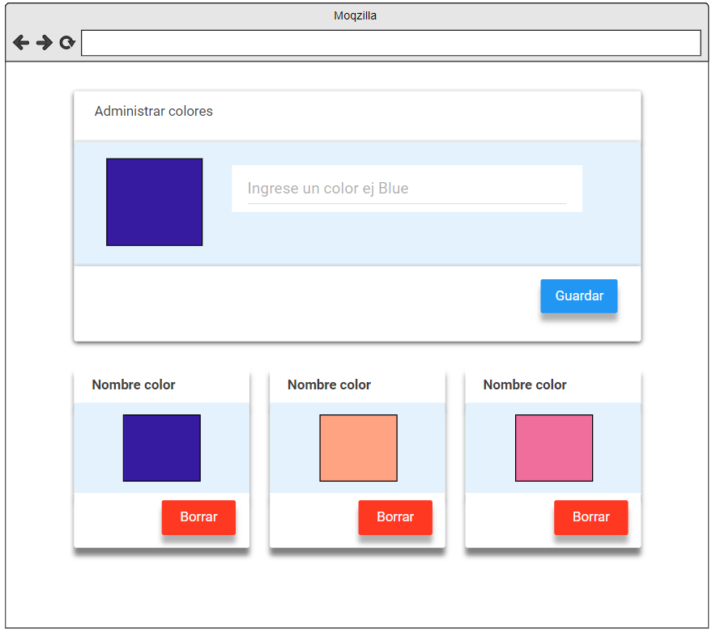

# Aplicación Web con React y Vite

Ejercicio N°4 del Trabajo Práctico de Backend correspondiente al curso Desarrollador Full Stack dictado por RollingCodeSchool.

## Enunciado

Paleta de colores: Consiste en crear una aplicación web que contenga un formulario con un input que al presionar un botón permita guardar un color. Se debe visualizar la paleta de colores. Cada color contará con al menos las siguientes propiedades: código único, nombre del color, código hexadecimal (opcional), código RGB o RGBA (opcional). Se debe poder ver en detalle, editar o borrar un color (CRUD).

## Integración con proyecto de Backend

Este proyecto de Frontend se integró a su proyecto Backend correspondiente donde se utilizó la base de datos no relacional de MongoDB para almacenar los datos de la paleta de colores.

#### Repositorio Backend: [backendPaletaColores](https://github.com/brunomry/backendPaletaColores.git)

## Prototipo 

## Link del proyecto

La aplicación está desplegada en Netlify. Puedes acceder a ella haciendo clic en el siguiente enlace:

[ejercicio 4](https://paletadecolores-bmr.netlify.app)

## Requisitos

- Node.js instalado en tu sistema. Puedes descargarlo [aquí](https://nodejs.org/).

## Pasos para clonar el repositorio

1. Clona este repositorio en tu máquina local a través de una terminal:

  git clone <[url-del-repositorio](https://github.com/brunomry/frontendPaletaDeColores.git)>

2. Navega al directorio del proyecto:

  cd frontendPaletaDeColores

3. Instala las dependencias del proyecto:

  npm install

## Tecnologías utilizadas

- React
- Vite
- JavaScript
- React-Bootstrap
- Bootstrap5
- Bootstrap Icons
- React-router-dom
- React-hook-form
- Json-server (para pruebas de desarrollo)
- Webpack
- CSS3

## Crear un proyecto con React usando Vite

Guía de pasos necesarios para crear un nuevo proyecto con React utilizando Vite.

### Pasos

### 1. Crear el proyecto

En tu terminal, navega hasta la carpeta donde deseas crear el proyecto o trabajo práctico.

npm create vite@latest

### 2. Configuración inicial

Después de ejecutar el comando anterior, se te pedirá que ingreses el nombre de tu proyecto. Escribe el nombre deseado y presiona Enter.

Se te pedirá confirmar el nombre del paquete. Selecciona la opción predeterminada (el mismo nombre del proyecto) y presiona Enter.

### 3. Seleccionar opciones

Se te presentará una lista de opciones para elegir el framework. Selecciona la opción de React.

Luego, se te pedirá que elijas el tipo de script a usar. Elige la opción de JavaScript, que utiliza webpack para configurar todo el proyecto de React.

Presiona Enter para confirmar tu selección.

### 4. Configuración final

Una vez confirmadas las opciones, se mostrarán los comandos que debes ejecutar en orden:

- `cd nombreProyecto`: Cambia al directorio del proyecto recién creado.
- `npm install`: Instala las dependencias del proyecto. Este comando solo necesita ejecutarse una vez.
- `npm run dev`: Inicia un servidor de desarrollo interno, similar a live server. Después de ejecutar este comando, se te proporcionará un enlace para acceder al template creado.

### 5. Desarrollo

Una vez que hayas ejecutado el tercer comando y tengas el servidor en funcionamiento, puedes continuar trabajando en tu proyecto desde la terminal de tu editor de código preferido. Para salir del servidor interno en la terminal, simplemente presiona `ctrl + c`.

## Autor

Bruno Madozzo Romay
